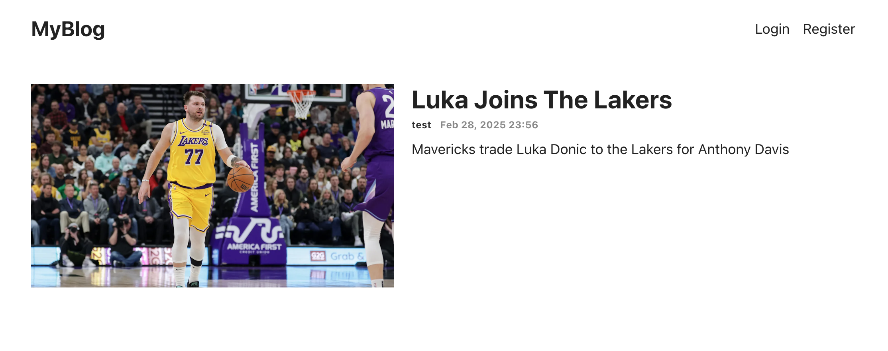
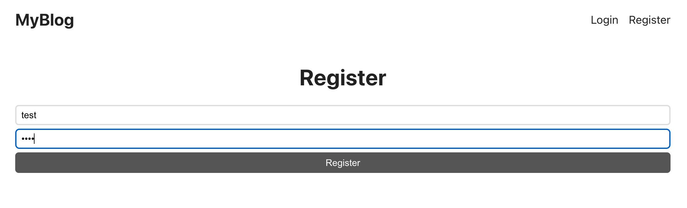
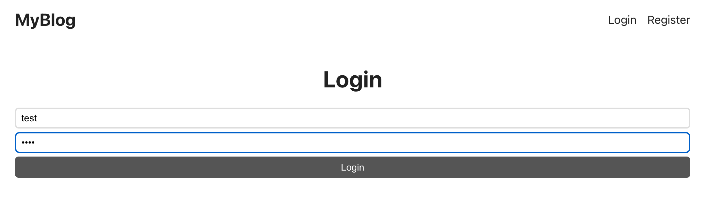
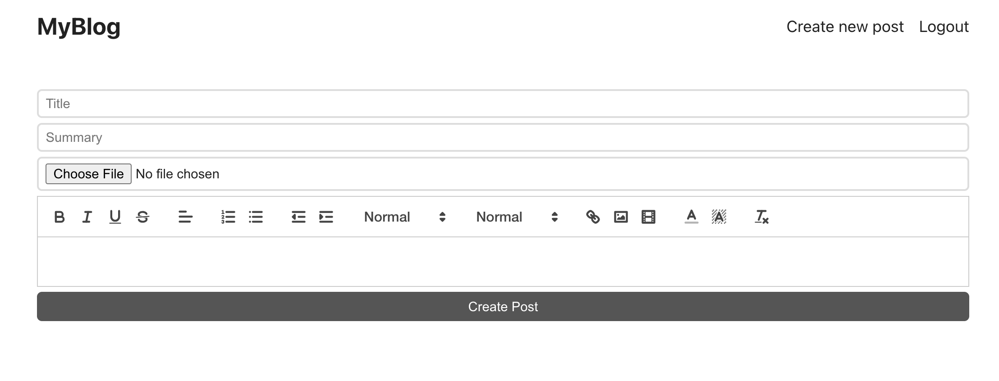
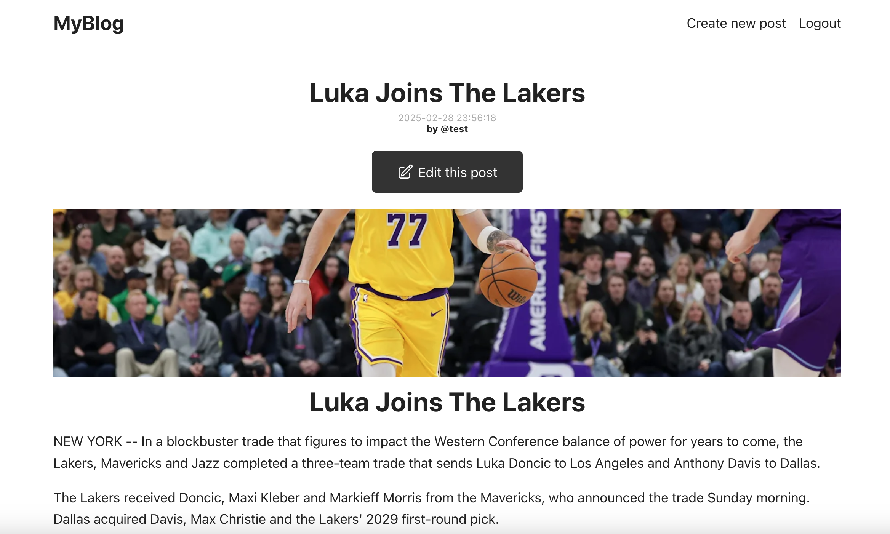
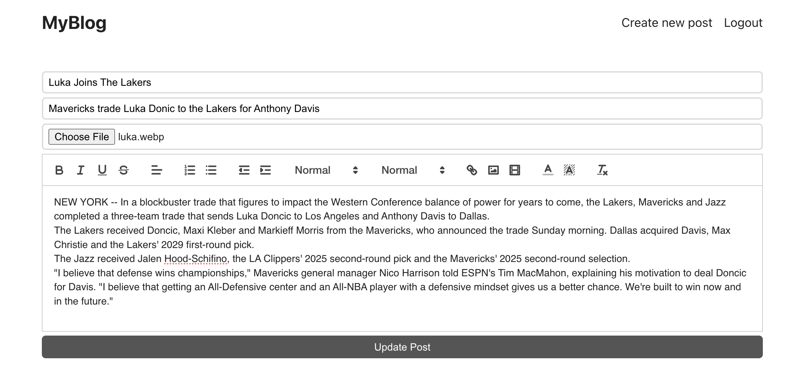

# blog_web_app

## About this project:

A blog platform where users can securely create, edit, and delete posts. It features a clean interface for managing content and includes access control to ensure users can only modify their own posts. The backend is optimized for fast and efficient data handling.

## Usage

Home Page:

Register Page:

Login Page:

Create Post Page:

Post Page:

Edit Post Page:

